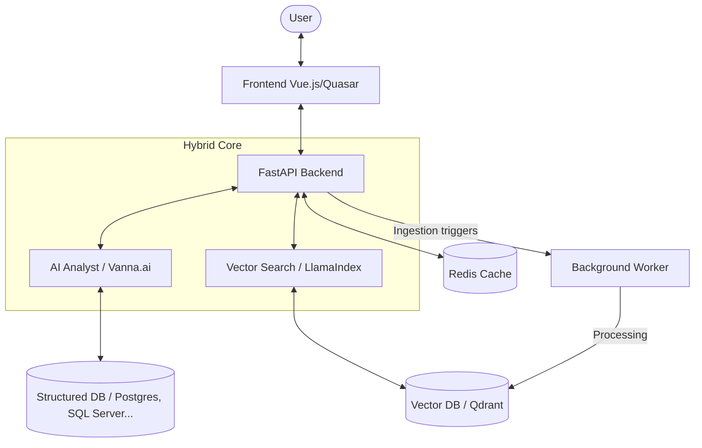

# Vectra Architecture

Vectra is an **Agentic RAG Assistant** designed to unify structured (SQL) and unstructured (Documents) data into a single, intuitive chat interface.

## Hybrid Architecture

Vectra relies on a powerful dual-engine architecture:

1.  **AI Analyst (Vanna.ai)**: An intelligent agent that generates SQL on-the-fly to answer ad-hoc questions and explore structured databases in real-time.
2.  **Vector Search (LlamaIndex)**: Retrieves precise answers from internal wikis and documents (PDF, Word, Excel, PowerPoint) via **Qdrant**.

## Main Components

### 1. Backend API (FastAPI)

The central orchestrator of the system:

- **Smart Routing**: Automatically detects user intent to route queries to either the AI Analyst or the Vector Search engine.
- **Deep Chat UI Orchestration**: Manages streaming responses and interactive chart rendering.
- **Security**: JWT-based enterprise-grade authentication.

### 2. AI Analyst (Vanna.ai)

Specialized in translating natural language into precise SQL queries. It allows for real-time exploration of structured data without pre-defined reports.

### 3. Vector Search (LlamaIndex & Qdrant)

The backbone for unstructured data retrieval. It indexes and searches through your company's documents, acting as a "collective memory".

### 4. Background Worker

Handles multimodal data ingestion and heavy vectorization workloads, ensuring the knowledge base is always up-to-date.

## Security & Privacy

- **Self-Hosted**: Full control over your data; sensitive information never leaves your infrastructure.
- **Model Agnostic**: Compatible with **Gemini**, **OpenAI**, **Mistral**, and **Ollama** (local inference).

---

## Data Flow

1. **User Request**: The user sends a natural language query.
2. **Intent Analysis**: The API determines if the answer lies in structured databases or unstructured documents.
3. **Execution**:
   - **SQL Path**: Vanna.ai generates and executes SQL.
   - **Vector Path**: LlamaIndex performs semantic search in Qdrant.
4. **Response Synthesis**: The LLM compiles the findings into a sourced and clear response.
5. **Streaming**: Results are streamed back to the UI in real-time.
