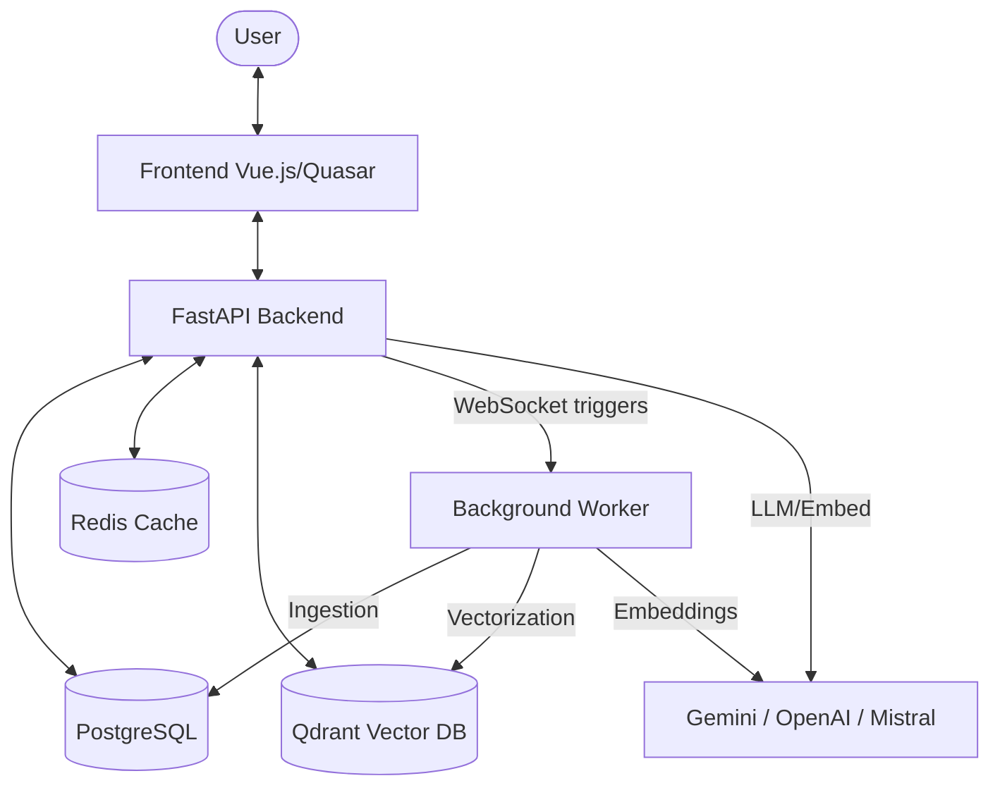

# Vectra Architecture

Vectra is an enterprise RAG (Retrieval-Augmented Generation) solution designed to transform unstructured data into actionable knowledge via an intelligent chat interface.

## Overview

The architecture follows a distributed model consisting of a reactive API, an asynchronous worker for data ingestion, and a multi-provider AI stack.

## Main Components

### 1. Backend API (FastAPI)

The heart of the system, responsible for real-time orchestration:

- **Session Management**: Authentication and conversation history.
- **RAG Orchestration**: Integration with **LlamaIndex** for chunking, indexing, and retrieval.
- **WebSocket Manager**: Real-time broadcast of responses and synchronization states.
- **Semantic Cache**: Uses **Redis** to store results for similar queries to reduce latency and costs.

### 2. Background Worker

An autonomous service dedicated to heavy tasks:

- **Multi-Source Ingestion**: Scanning and extracting data from various sources (Connectors).
- **Vectorization Pipeline**: Transforming documents into vectors via embedding models (Gemini 004).
- **Real-Time Synchronization**: Connected to the API via WebSocket to react instantly to user requests.

### 3. Persistence Layer

- **PostgreSQL**: Stores metadata, connector configurations, and document structure.
- **Qdrant**: High-performance vector database for ultra-fast semantic search.
- **Redis**: Semantic cache and temporary storage.

### 4. Artificial Intelligence

Vectra is "Model Agnostic" but optimized for the Google Cloud suite:

- **Chat Models**: Gemini 1.5 Pro/Flash for complex reasoning.
- **Embeddings**: Gemini Text Embedding 004 for state-of-the-art semantic representation.
- **Reranking**: Uses reranking models to refine result relevance.

## Data Flow (RAG)

1. **Request**: The user asks a question via the frontend.
2. **Cache**: The API checks Redis to see if a similar question has already been processed.
3. **Retrieval**: If not, Vectra queries Qdrant to extract the most relevant passages.
4. **Augmentation**: The extracted context is injected into the LLM prompt.
5. **Generation**: The LLM generates a sourced and accurate response.
6. **Streaming**: The response is sent back in chunks via WebSocket for a smooth user experience.
